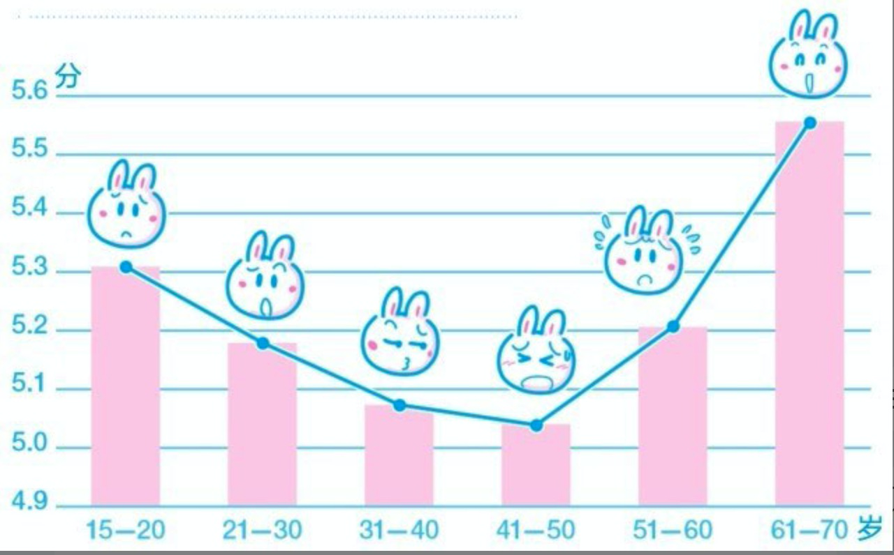

## 210819 星期四 15：20 要管理的不是时间，而是自己

> 我自己也是在写作的过程中才清楚地意识到“管理时间”的说法有多么荒谬。人是没办法管理时间的，时间也不听从任何人的管理，它只会自顾自一如既往地流逝。“管理时间”只不过是人们的一厢情愿而已。换言之，人类能做的事情顶多只不过是发明改进测量时间的工具而已，根本没有任何办法去左右时间。

不要谈什么管理时间，因为时间你管不了，时间不会随着任何人的意志而改变，他就那里静静的流淌，因为受管理的只能是我们自己。

作者在书中介绍了两个常见的例子，可以总结为：

1. 拖延症，不专心：没有在任务的最后期限内完成任务，而是在过程中左顾右盼，没有集中精力，等到期限来临的时候有惊呼：时间都哪去了，然后开始悔恨、焦虑。
2. 假勤奋：时间不够用了才开始行动，真是压力山大，所以只能用最笨的方法死记硬背，假勤奋希望寻找洁净。

对于问题一作者也给出了解决办法：

| 问题                           | 解决方案                       |
| ------------------------------ | ------------------------------ |
| 没有按时开始执行任务。         | 按时开始执行任务。             |
| 错误估算完成任务所需时间。     | 正确估算完成任务所需时间。     |
| 在任务的执行过程中出现了差错。 | 在执行任务的过程中不要出差错。 |

问题和解决办法都很简单，显而易见，但是却没有几个人能够真正做到。

==如何解决假勤奋？从容的面对任务达到：不以物喜不以己悲？==这个答案还需要继续寻找

----

**我的思考：**

这一章给我带来的是思想的转变：一直以为我们能够管理时机，但是现在我明白了，时间不受任何人管理我们管理的只能是我自己；时间的流淌是不会受任何人控制的，所以一旦明确一个事儿、一个任务后他都会有一个最后的期限，只要我们按部就班的开始就绝对不会有问题，就想上面表格里面列举的方案，即使有偏差也不会他大。但大多数时候我们在过程中左顾右盼，常常把开始时间拖得很晚很晚，最好的期限快到了，才惊呼：时间都去那儿了！！焦虑也就随之而来，开始了“假勤奋”式的补救工作。

所以不要期望让时间变慢，做了决定就做好计划按部就班的开始，任务量要量力而行，在实践中不断修正计划。千万不要期待能速成，要学会和时间做朋友，体会复利的强大。

## 210819 星期四 15：45 速成绝无可能

期望速成，从微观层面上看，有两个主要原

> 1. 人的天性：希望自己的欲望马上得到满足。每个人都有无尽的欲望，虽然每个人都知道并不是所有的欲望都可以得到满足，但人还是会尽可能的追逐尽可能多的欲望，于是不劳而获成了人们心中最大的愿望。就算达不到不劳而获，也应该是少劳多获。从这个角度进一步的讲==大多数人都抱着类似这样的想法：如果收获的可能性很大，最好马上看到成果；如果收获的可能性很小，最好马上知道结果。==所以这就是为啥很多人会去赌博，因为他立马可以见到结果。
> 2. 很多人不懂==“有些阶段就是无法跨越”这个道理，这也是浮躁的根源==。因此，他们才那么不现实地希望找到一个方法，靠其迅速达成目标，完结任务，获得解脱。可是，无论做什么事都需要时间，而且可能需要很长时间。比如怀孕生孩子，你在努力也得十月怀胎

**人对于自己的满意度是不断变化的**

> 在这漫长的30年里，由自我满意度持续下降所造成的浮躁形成了巨大的心理压力。越是浮躁，就越是对自己的现状不满；越是对自己的现状不满，就越是浮躁。
>
> ==更大的问题在于，大多数人并不知道几乎所有的人都是这样。相反，现实好像总是提醒我们：有些人过得比我们好多了。==

人们总是不由自主地期望速成的根源:

> 一方面是自己的欲望无限，一方面是要完成的事情太多，一方面是自我满意度的不断下降

解决方案：

>==出路肯定存在，但这出路只有一个起点：接受现实。告诉自己：我有不足，我需要时间，我没办法一蹴而就。==

----

**我的思考**

人生到底有没有快捷键？应该是有的，只不过这些来钱道儿都应该写到了刑法里面。

人的欲望时无止境的，明知道有些欲望是满足不了地，但还是幻想能以多快好省的方式追逐，所以不劳而获、天上掉馅饼就成了绝大多数人的梦想，从这个角度触发继续深入将：绝大对数人都在追求立即见效，无论收益大小立即见效就是最好的，所以赌博这种见效极快的游戏让很多人陷入其中。

但是很多人都不懂”有些阶段是无法跨越的“只能一步一步的熬过去才，这也是==浮躁==的根源。因此，他们才那么不现实地希望找到一个方法，靠其迅速达成目标，完结任务，获得解脱。可比如十月怀胎，你再怎么努力都无法免去这个过程。

从作者提供的数据来看，人类各个阶段的满意程度是一个U型曲线，并不是你没有变好，而是欲望变多了，开始不切实际的想找捷径超近道，以至于越来越浮躁，其实大多数人都不知道几乎所有的人都是这样的，而我们看见的现实太片面，好像总是在提醒我们：有些人过得比我们好多了。这样就开始了恶性循环。

**总的来说，人之所以不由自主的期望速成是因为：无限的欲望、不知道有些阶段是无法逾越的、自我的满意度不断下降**。那么如何寻找出路呢，作者也给出了答案：*接受现实。告诉自己：我有不足，我需要时间，我没办法一蹴而就。*

## 210820 星期五 15：14 想要实现欲望就得拿你有的换

速成不可能，那该怎么办？答案之后一个字：换。俗话说“一分耕耘一分收获”，本质上也就是一个字：换。

不成熟人的特征有很多，但有一个通病就是每天只想“我要什么”，全然不顾自己压根没有交换的本钱。可交换的本钱是什么呢：可以是时间、努力、金钱。哪些积累多的人之所以文件，是因为对他们来说，“我要”的欲望，是可以用“我有”的东西来交换的。就算“我有的东西”暂时不足以，那么也能借助已经拥有的经验、努力、勤奋（抑或是投机取巧）乘以时间的复利，假以时日，定能如愿以偿。一旦得偿所愿，不仅“我有”的更多，“我要”的也更容易满足，如此形成良性循环。

有一个辅助的手段可以让你瞬间“脚踏实地”：当你想到“我要什么”的时候，马上提醒自己你有什么是可以拿去换的。脑子想不清楚就列一个表格，一遍写上自己想要的，另外一遍写上自己有的，或者需要有的。最坏的情况是，拿出纸和笔认真面对自己，结果发现“我什么都没有”。这也许令人气馁，但其实对任何一个正常人来说，还有时间、还有精力、还有正常的智商就已经足够了。只要努力，只要勤奋，机会总是存在的——我们必须要相信这一点，最好相信到毫不怀疑。

## 210820 星期五 15：40 不要钻牛角尖，未知永远存在